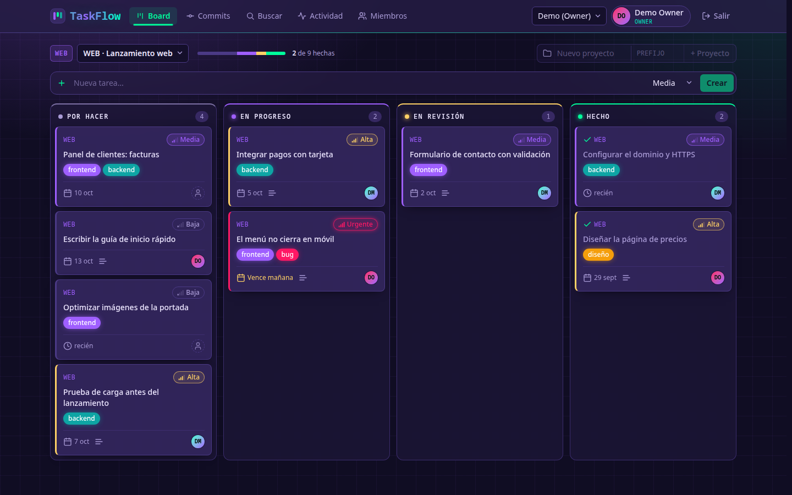
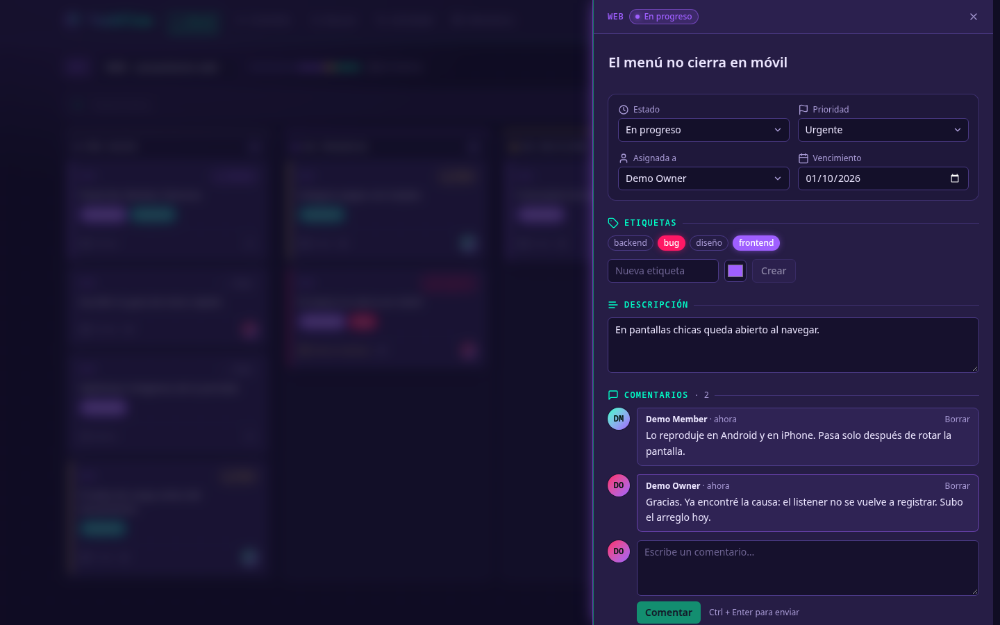
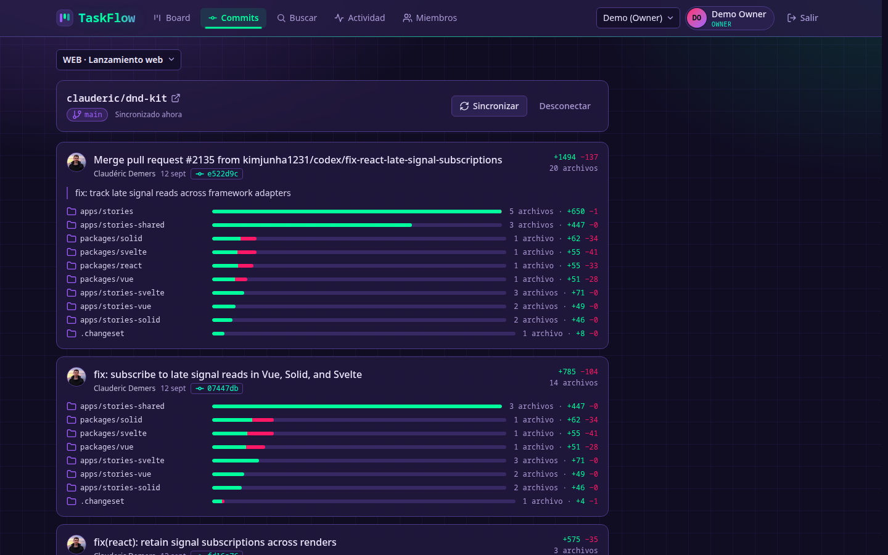
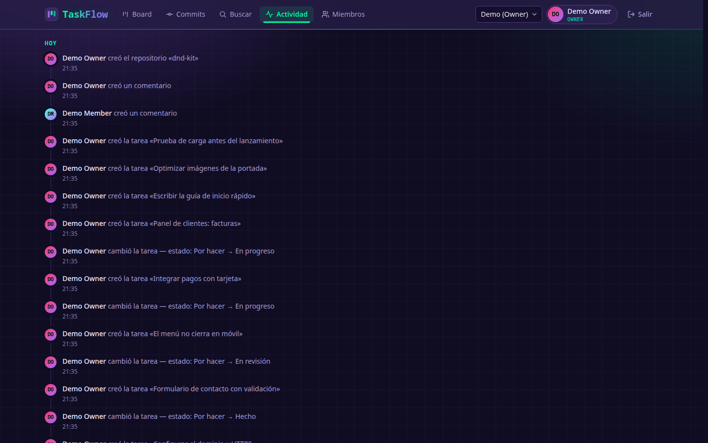
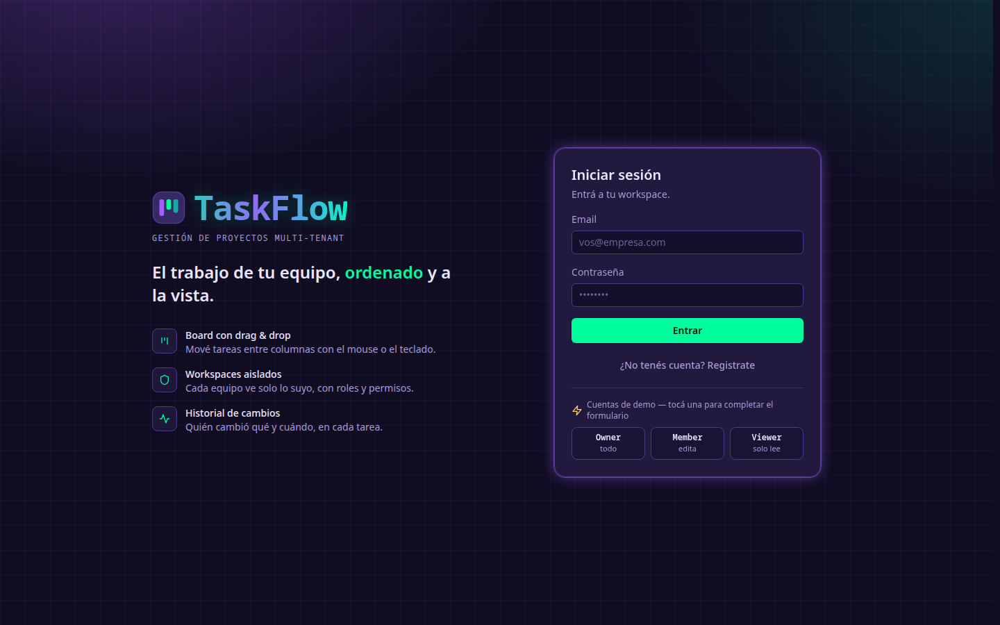
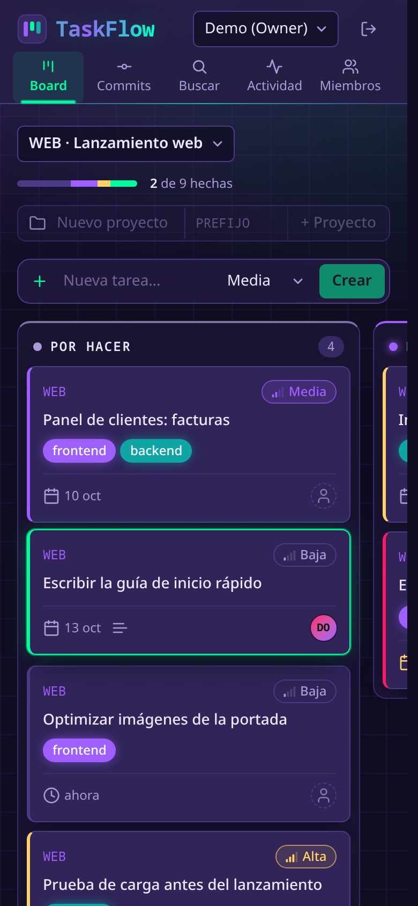

# TaskFlow

**Gestión de proyectos multi-tenant**, al estilo Trello o Linear: varias organizaciones comparten una misma
instancia con sus datos completamente aislados, roles por organización, un board con drag & drop y los
commits de GitHub de cada proyecto explicados carpeta por carpeta.

ASP.NET Core 10 · EF Core · PostgreSQL · React 19 · TypeScript

[](https://github.com/miguelespinozaa-ship-it/TaskFlow/actions/workflows/ci.yml)

**Versión 1.0** — funcional de punta a punta, con 240 tests automáticos y 7 pruebas de navegador que corren en cada push.



## Índice

- [Capturas](#capturas)
- [Qué hace](#qué-hace)
- [Cómo correrlo](#cómo-correrlo)
- [Arquitectura](#arquitectura)
- [Stack](#stack)
- [Decisiones técnicas](#decisiones-técnicas)
- [Tests](#tests)
- [API](#api)
- [Problemas que aparecieron y cómo se resolvieron](#problemas-que-aparecieron-y-cómo-se-resolvieron)
- [Limitaciones conocidas](#limitaciones-conocidas)
- [Próximos pasos](#próximos-pasos)

## Capturas

| Detalle de una tarea | Commits de GitHub por carpeta |
|---|---|
|  |  |

| Historial de actividad | Inicio de sesión | Móvil |
|---|---|---|
|  |  |  |

## Qué hace

**Organizaciones aisladas (multi-tenancy)**
- Cada organización es un *workspace*. Un usuario puede pertenecer a varios y cambiar entre ellos.
- Los datos de un workspace son invisibles para los demás: pedir un recurso ajeno responde **404, no 403**,
  para no confirmar siquiera que existe.
- Roles por workspace: **Owner, Admin, Member y Viewer** (solo lectura). La misma persona puede ser Owner en
  uno y Viewer en otro.

**Trabajo del día a día**
- Proyectos con su board de cuatro columnas. Las tarjetas se mueven con el mouse, con el dedo o con el teclado.
- Tareas con prioridad, persona asignada, vencimiento, etiquetas, descripción y comentarios.
- Búsqueda de texto en español ("factura" encuentra "facturas"), combinable con filtros por proyecto, estado,
  persona y etiqueta.
- Historial automático: cada cambio queda registrado con quién lo hizo, el valor anterior y el nuevo.
- Lo que se borra no se pierde: se marca como borrado y deja de mostrarse.

**Integración con GitHub**
- Cada proyecto se puede conectar a un repositorio público.
- Por cada commit se ve la explicación (el mensaje que escribió su autor) y la **lista de carpetas que tocó**,
  con archivos y líneas agregadas y quitadas.
- Se sincroniza con un botón y, además, sola cada pocos minutos.

**Sesión y seguridad**
- Contraseñas con ASP.NET Core Identity y bloqueo de la cuenta tras 5 intentos fallidos.
- Token de acceso de 15 minutos guardado solo en memoria, y token de renovación en una cookie `httpOnly`:
  ninguno de los dos es legible desde JavaScript.
- El token de renovación cambia en cada uso. Si alguien presenta uno ya usado, se cierran todas las sesiones
  de esa familia.
- Límite de intentos de login y registro por dirección IP.

**Operación**
- `/health/live` (el proceso responde) y `/health/ready` (llega a la base), separados para que una caída de
  PostgreSQL saque a la API del balanceador sin reiniciarla en bucle.
- Logs estructurados en JSON, con el usuario, el workspace y el identificador de traza de cada pedido.
- Integración continua: cada push compila, corre los tests, construye las imágenes y ejecuta las pruebas de navegador.

## Cómo correrlo

### Con Docker (solo hace falta Docker)

```bash
git clone git@github.com:miguelespinozaa-ship-it/TaskFlow.git
cd TaskFlow
cp .env.example .env          # y completa JWT_SECRET (el archivo explica cómo generarla)
docker compose --profile app up --build
```

La aplicación queda en **http://localhost:8080**. La API aplica las migraciones al arrancar y no se publica
en el host: solo se llega a ella a través de nginx, que sirve el frontend y reenvía `/api`.

### Para desarrollar

Requisitos: **.NET 10 SDK**, **Docker** y **Node 20** o superior.

```bash
docker compose up -d postgres

dotnet tool restore
dotnet ef database update -p src/TaskFlow.Infrastructure -s src/TaskFlow.Api
dotnet run --project src/TaskFlow.Api          # API en http://localhost:5080

# en otra terminal
cd web/taskflow-web
npm install
npm run dev                                    # app en http://localhost:5173
```

En modo desarrollo (y en Docker, salvo que se desactive con `SEED_DEMO_DATA=false`) la API crea un workspace "Demo" con tres usuarios, todos con la contraseña `Demo1234`:

| Email | Rol |
|---|---|
| `demo@taskflow.dev` | Owner |
| `member@taskflow.dev` | Member |
| `viewer@taskflow.dev` | Viewer (solo lectura) |

Configuración opcional, por variables de entorno:

| Variable | Para qué |
|---|---|
| `Jwt__Secret` | Clave de firma de los tokens. **Obligatoria fuera de desarrollo** (la del repositorio es solo para desarrollo local). |
| `GitHub__Token` | Sube el límite de la API de GitHub de 60 a 5000 consultas por hora. Alcanza con un token sin permisos. |
| `GitHub__SyncIntervalMinutes` | Cada cuánto se sincronizan los repositorios (por defecto 5; 0 lo desactiva). |
| `RateLimiting__Auth__PermitLimit` | Intentos de login o registro por IP y por minuto (por defecto 10). |
| `OTEL_EXPORTER_OTLP_ENDPOINT` | Si está definida, las trazas se exportan por OTLP a ese colector. |
| `PORT` y `API_URL` | Puerto del frontend y dirección de la API, para `npm run dev`. |

## Arquitectura

Clean Architecture: las dependencias apuntan siempre hacia adentro.

```
Api  →  Infrastructure  →  Application  →  Domain
```

| Proyecto | Responsabilidad |
|---|---|
| `TaskFlow.Domain` | Entidades y reglas de negocio. **No depende de nada**, ni de EF Core ni de ASP.NET. |
| `TaskFlow.Application` | Casos de uso, DTOs, validación e interfaces (repositorios, cliente de GitHub, tenant actual). |
| `TaskFlow.Infrastructure` | EF Core y PostgreSQL, Identity, emisión de tokens, cliente HTTP de GitHub, tareas en segundo plano. |
| `TaskFlow.Api` | Controllers, políticas de permisos, resolución del tenant y manejo uniforme de errores. |
| `web/taskflow-web` | Frontend en React. |

Esa regla no es solo un diagrama: hay tests de arquitectura que **fallan el build** si `Domain` o `Application`
llegan a depender de EF Core, de ASP.NET o de una capa externa.

### Cómo se aíslan los workspaces

1. El workspace activo viaja dentro del token firmado. Nunca se lee de la URL, de un header ni del cuerpo del
   pedido, así que el cliente no puede elegir sobre qué organización opera.
2. Un filtro global de EF Core agrega `workspace_id = <el del token>` a todas las consultas, sin que cada
   caso de uso tenga que acordarse.
3. Al guardar, el contexto sella el workspace en las entidades nuevas.
4. Las tareas en segundo plano fijan el workspace antes de tocar la base, y corren con el mismo aislamiento
   que un pedido de ese workspace.

## Stack

| Capa | Tecnología | Por qué |
|---|---|---|
| Runtime | .NET 10 (LTS) | Soporte hasta 2028. |
| API | ASP.NET Core con controllers | El estilo que más se usa en equipos de producto. |
| Datos | EF Core 10 + PostgreSQL 17 | `jsonb`, índices parciales, búsqueda de texto y comparación de tuplas, todo nativo. |
| Identidad | ASP.NET Core Identity + JWT | Hash de contraseñas con sal y bloqueo por intentos, sin reinventarlos. |
| Validación | FluentValidation | Reglas componibles y mensajes por campo. |
| Tests | xUnit v3 + Shouldly + Testcontainers + NetArchTest | Postgres real en Docker en vez del proveedor en memoria. |
| Frontend | React 19 + TypeScript + Vite | |
| Datos en el cliente | TanStack Query | Caché, reintentos y actualizaciones optimistas. |
| Estilos | Tailwind CSS v4 | Tema propio definido como tokens. |
| Drag & drop | dnd-kit | Accesible con teclado y táctil. |

## Decisiones técnicas

1. **Un esquema compartido con `workspace_id`**, en vez de una base o un esquema por cliente. Es lo que
   escala para un producto de autoservicio: una sola conexión y una sola migración. El costo es que el
   aislamiento depende del código, y por eso hay tests dedicados a romperlo.
2. **El filtro de tenant lee el workspace en cada consulta.** EF Core construye el modelo una sola vez y lo
   reutiliza: si el filtro capturara el valor al construirse, quedaría fijo con el primer workspace que
   pasó por la aplicación.
3. **404 en vez de 403 para recursos de otro workspace.** Un 403 le confirma al atacante que el recurso existe.
4. **UUID v7 como clave primaria.** No se pueden enumerar (no revelan cuántos clientes o tareas hay) y, al
   estar ordenados por tiempo, no fragmentan el índice como los UUID aleatorios.
5. **Paginación por cursor `(created_at, id)`**, no por `OFFSET`. El costo es el mismo en la página 1 que en
   la 1000, y no se repiten ni se saltan filas si alguien inserta mientras otro pagina.
6. **Posiciones fraccionarias en el board.** Mover una tarjeta entre dos vecinas actualiza una sola fila
   (el punto medio de sus posiciones) en vez de renumerar la columna. Cuando se agotan los decimales, la
   columna se renumera con un único `UPDATE`.
7. **Borrado lógico y auditoría dentro de `SaveChanges`.** Ningún caso de uso puede olvidarse de auditar, y
   el registro se escribe en la misma transacción que el cambio.
8. **Validar en la aplicación y garantizar en la base.** "¿Ya existe ese email, esa etiqueta, ese prefijo?" se
   comprueba para dar un mensaje claro, pero dos pedidos simultáneos pasan los dos esa comprobación: quien
   decide es un índice único.
9. **Tokens de renovación guardados como hash**, con revocación atómica (`UPDATE … WHERE revoked_at IS NULL`):
   dos renovaciones simultáneas con el mismo token no pueden ganar las dos.
10. **Cerrado por defecto.** Todo endpoint exige autenticación salvo que se marque explícitamente como público.
11. **GitHub solo con repositorios públicos y consultas condicionales.** Si el servidor tuviera un token,
    cualquier workspace podría enlazar repositorios privados de su dueño; por eso se rechazan. Y cuando no hay
    commits nuevos, GitHub responde `304` y la consulta no descuenta del límite.

## Tests

```bash
dotnet test --solution TaskFlow.slnx     # 240 tests; los de integración necesitan Docker

# pruebas de navegador, contra el sistema levantado con Docker (AUTH_RATE_LIMIT=1000 en .env)
cd web/taskflow-web && npx playwright install chromium && npm run e2e
```

| Tipo | Qué prueba |
|---|---|
| Unitarios | Reglas del dominio: tareas, proyectos, comentarios, posiciones del board, agrupado de carpetas, cursores. |
| Arquitectura | Que `Domain` y `Application` no dependan de capas externas. |
| Integración | La API completa contra un PostgreSQL real levantado con Testcontainers. |
| Navegador | Siete flujos con Playwright contra las imágenes de Docker: sesión, board con mouse y teclado, detalle, aislamiento y solo lectura. |

Algunos de los que más dicen sobre el sistema:

- Un token de la organización A no puede leer, modificar ni borrar nada de la B (siempre 404).
- Reutilizar un token de renovación revoca toda la familia, y cinco renovaciones simultáneas con el mismo
  token dejan pasar a una sola.
- Un token con datos válidos pero firmado con otra clave es rechazado.
- La matriz completa de roles contra permisos.
- Cincuenta inserciones en el mismo hueco del board, que obligan a renumerar la columna.
- Paginar mientras se insertan filas no repite ni saltea resultados.
- Diez creaciones simultáneas de un proyecto con el mismo prefijo dejan un solo proyecto.
- El cliente de GitHub frente a límite agotado, errores del servidor y avatares de dominios ajenos.

Varios de estos tests se verificaron además **rompiendo el código a propósito** (por ejemplo, desactivando el
filtro de tenant o el renumerado del board) para confirmar que fallan cuando deben.

## API

Base `/api/v1`. Todo requiere `Authorization: Bearer <token>` salvo lo marcado como público. Los errores se
devuelven siempre como `ProblemDetails` (RFC 9457).

| Método | Ruta | Rol mínimo | Descripción |
|---|---|---|---|
| POST | `/auth/register` | público | Crea el usuario y su workspace personal, en una transacción |
| POST | `/auth/login` | público | Token de acceso y cookie de renovación |
| POST | `/auth/refresh` | cookie | Renueva la sesión y rota el token |
| POST | `/auth/logout` | cookie | Cierra la sesión |
| POST | `/auth/switch-workspace` | miembro | Cambia de workspace |
| GET | `/auth/me` | — | Usuario y sus workspaces |
| GET / POST | `/workspaces` | — | Mis workspaces / crear uno |
| GET / POST | `/workspaces/current/members` | Viewer / Admin | Miembros / agregar uno |
| GET / POST | `/projects` | Viewer / Member | Listar (`?includeArchived=true`) / crear |
| GET / PATCH / DELETE | `/projects/{id}` | Viewer / Member / Admin | Detalle / editar / borrar con sus tareas |
| POST | `/projects/{id}/archive` · `/unarchive` | Admin | Archivar / desarchivar |
| GET / POST | `/projects/{id}/tasks` | Viewer / Member | Board / crear tarea |
| GET | `/tasks` | Viewer | Búsqueda con filtros, texto y cursor |
| GET / PATCH / DELETE | `/tasks/{id}` | Viewer / Member / Member | Detalle / editar / borrar |
| POST | `/tasks/{id}/move` | Member | Mover en el board `{ status, afterTaskId? }` |
| POST | `/tasks/{id}/assign` | Member | Asignar a un miembro |
| PUT | `/tasks/{id}/labels` | Member | Reemplazar etiquetas |
| GET / POST | `/tasks/{id}/comments` | Viewer / Member | Comentarios |
| PATCH / DELETE | `/comments/{id}` | autor / autor o Admin | Editar / borrar |
| GET / POST | `/labels` | Viewer / Member | Etiquetas del workspace |
| PATCH / DELETE | `/labels/{id}` | Admin | Editar / borrar |
| GET | `/activity` · `/tasks/{id}/activity` | Viewer | Historial paginado |
| GET | `/projects/{id}/repository` | Viewer | Repositorio conectado (204 si no hay) |
| PUT / DELETE | `/projects/{id}/repository` | Admin | Conectar / desconectar |
| POST | `/projects/{id}/repository/sync` | Member | Importar commits nuevos |
| GET | `/projects/{id}/commits` | Viewer | Commits con sus carpetas, paginados |

Fuera de `/api/v1`: `GET /health/live` y `GET /health/ready`, públicos.

En desarrollo, la especificación OpenAPI está en `/openapi/v1.json`.

## Problemas que aparecieron y cómo se resolvieron

- **El filtro de tenant que no filtraba.** La primera versión capturaba el workspace como una constante al
  construir el modelo de EF Core. Como el modelo se construye una vez y se cachea, el filtro quedaba fijo. La
  solución fue que la expresión lea una propiedad del contexto, que EF evalúa en cada consulta. Hay un test de
  regresión que lo cubre.
- **Dos registros simultáneos con el mismo email.** Identity valida que el email sea único consultando antes
  de insertar, y dos pedidos a la vez pasaban los dos. Se agregó un índice único en la base.
- **Borrar una tarea borraba sus etiquetas.** Al convertir el borrado en borrado lógico, EF ya había marcado
  para eliminar las filas relacionadas. Se difirieron las cascadas hasta el momento de guardar.
- **El historial no registraba los borrados.** El código guardaba las entradas del `ChangeTracker` en un
  conjunto para reconocerlas después, pero EF crea una instancia nueva en cada consulta y nunca coincidían.
  Ahora se comparan las entidades por referencia.
- **El detalle de la tarea se abría y se cerraba solo con Enter.** El panel se abría durante el `keydown` y
  movía el foco al botón "Cerrar"; el `keypress` siguiente caía sobre ese botón. Se resolvió cancelando el
  comportamiento por defecto de la tecla.
- **Un test que pasaba sin probar nada.** El test del renumerado del board pasaba incluso con el renumerado
  desactivado: 40 inserciones no alcanzaban para agotar los decimales. Subió a 50, y ahora falla si falta.
- **Fechas de vencimiento un día corridas.** Se guardaban como medianoche UTC y se mostraban en hora local, así
  que en zonas al oeste de Greenwich aparecía el día anterior. Ahora se tratan como día, sin hora.

## Limitaciones conocidas

- Un cambio de rol o una expulsión tarda hasta 15 minutos en aplicarse (lo que dura el token de acceso).
- Para agregar a alguien a un workspace, esa persona ya tiene que tener una cuenta; no hay invitaciones por email.
- GitHub: solo repositorios públicos, y un commit nuevo puede tardar unos minutos en aparecer porque la
  aplicación consulta periódicamente en vez de recibir webhooks. Sin token, el límite es de 60 consultas por
  hora, y cada sincronización importa como mucho 15 commits.
- Dos pestañas que renuevan la sesión exactamente a la vez pueden cerrar la sesión de ambas.
- No hay modo claro.

## Próximos pasos

- **Despliegue** en un servicio en la nube, con HTTPS y publicación de las imágenes.
- **Tiempo real**: que el board se actualice solo entre navegadores con SignalR.
- **Invitaciones por email** y webhooks de GitHub.
- **Cobertura de tests** medida y publicada en cada corrida del CI.
